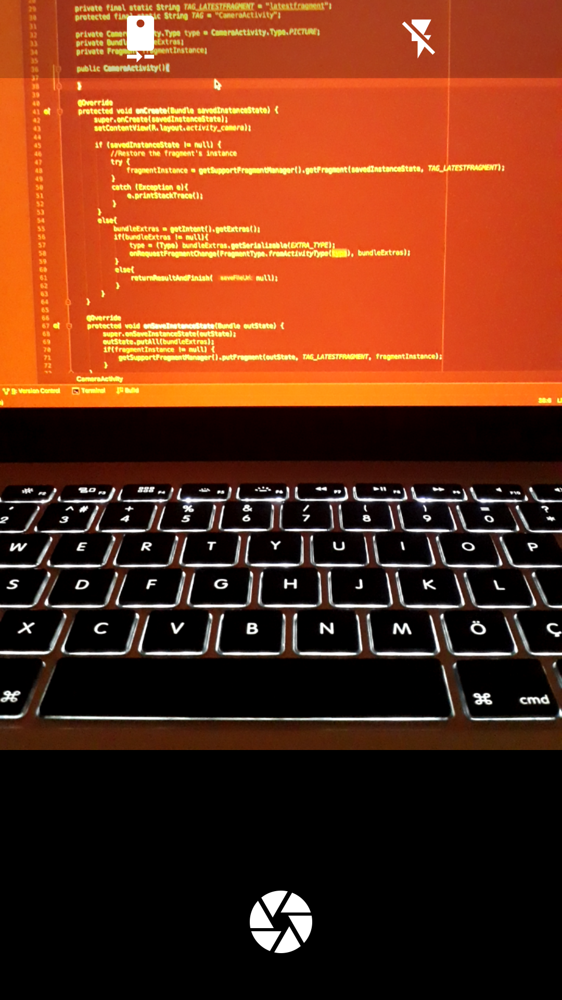
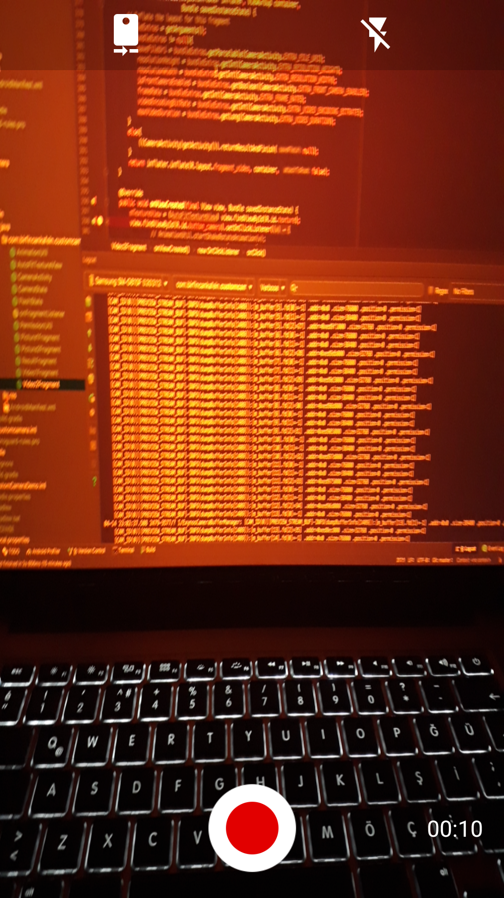
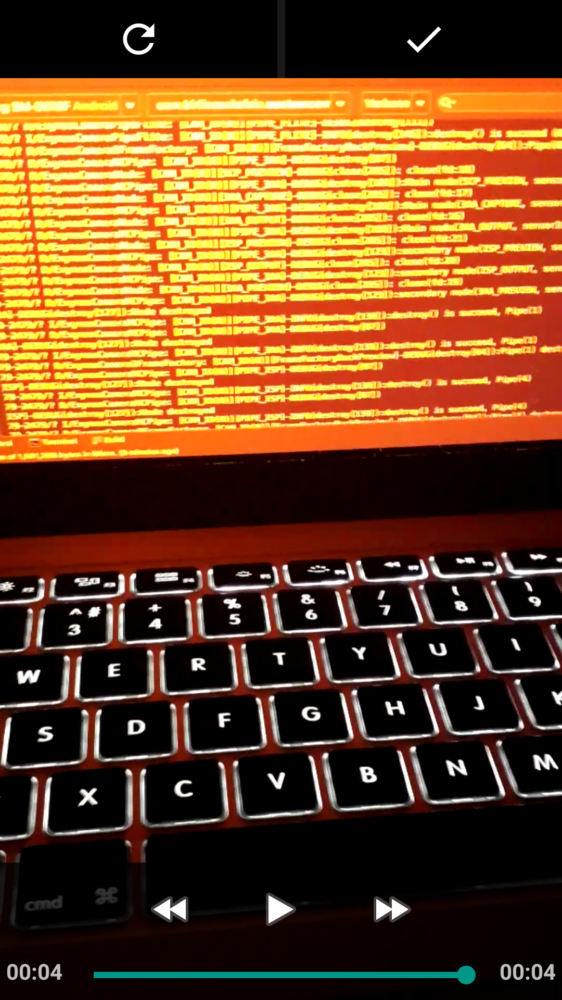
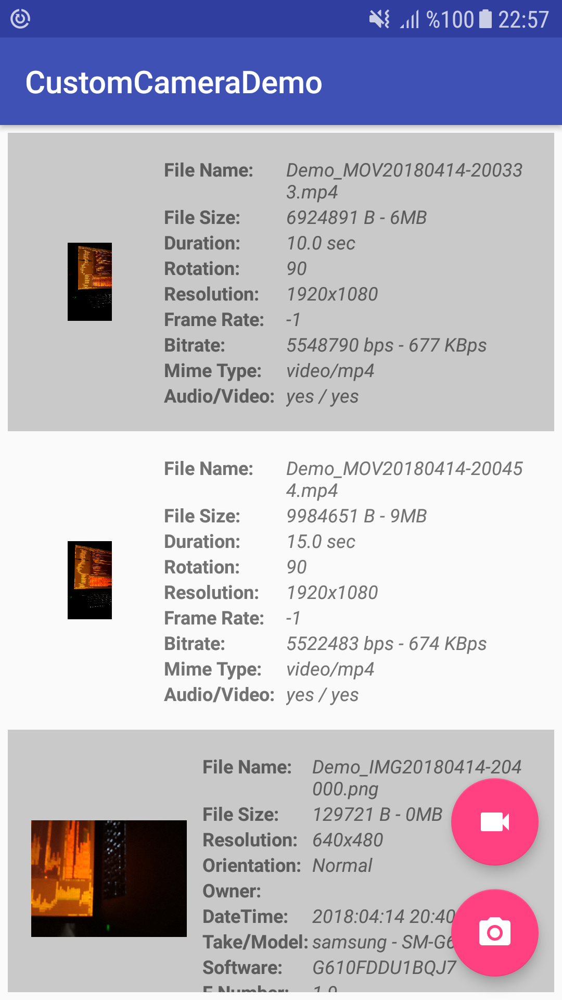

[](https://bintray.com/birfincankafein/com.birfincankafein/customcamera/_latestVersion)  []()

What is  CustomCamera?
===================================

CustomCamera is an Android library that provides support for Camera and  Camera2 API. It automatically selects API based on device. After Android API 21 (Lollipop) library uses [Camera2 API](https://developer.android.com/reference/android/hardware/camera2/package-summary.html  ), otherwise uses [Camera API](https://developer.android.com/guide/topics/media/camera.html).
This library includes codes from [android-Camera2Video](https://github.com/googlesamples/android-Camera2Video) and [android-Camera2Basic](https://github.com/googlesamples/android-Camera2Basic). The samples edited for supporting custom features like setting frame rate, setting resolution etc.

  Usage
-----
In order to use the library, there are 3 different options:

**1. Gradle dependency**

  -  Add this to your app `build.gradle`:
 ```gradle
dependencies {
	implementation 'com.birfincankafein:customcamera:1.0.1'
}
```

**2. Maven**
- Add the following to the `<dependencies>` section of your `pom.xml`:
 ```xml
<dependency>
        <groupId>com.birfincankafein</groupId>
        <artifactId>customcamera</artifactId>
        <version>1.0.1</version>
</dependency>
```

**3. Ivy**
- Add the following to the `<dependencies>` section of your `ivy.xml`:
```xml
<dependency org='com.birfincankafein' name='customcamera' rev='1.0.1'> <artifact name='customcamera' ext='pom' /> </dependency>
```

Features
--------
- Automatic Camera API selection.
- Permission handling. No need to check CAMERA and RECORD_AUDIO permissions.
- Rotation handling.
- Result screen support. User can recapture or confirm the captured media.
- Supports Android API >= 16
- Configuration by attributes
  - Save File
  - Resolution
  - Front Camera Access
  - Frame Rate for Video
  - Video Encoding BitRate
  - Max Video Duration

How to Use
------------
You can use `CameraActivity.Builder` for setting up the camera. You can set  image capturing or video recording, resolution, video recorder's maximum duration, video recorder's frame rate etc with the Builder.

* Video record example:
```java
 // Start video recorder.
 Intent videoIntent = new CameraActivity.Builder(mContext)
    .setActionType(CameraActivity.Type.VIDEO)
    .setSaveFileUri(mPendingMediaUri)
    .setResolution(1080, 1920)
    .setFrontCameraEnabled(true)
    .setFrameRate(30)
    .setMaxVideoDuration(15000)
    .setVideoEncodingBitRate(10000000)
    .build();
startActivityForResult(videoIntent, ACTIVITY_REQUESTCODEVIDEO);

// Handle video recorder response
@Override protected void onActivityResult(int requestCode, int resultCode, Intent data) {
    switch (requestCode){
	    ...
	    case ACTIVITY_REQUESTCODEVIDEO:
	        if(resultCode == RESULT_OK) {
	            Bundle bundle = data.getExtras();
	            if (bundle != null) {
	                Uri fileUri = bundle.getParcelable(CameraActivity.EXTRA_FILE_URI);
	                ...
	            }
	        }
	        else {
	            Toast.makeText(this, "Canceled", Toast.LENGTH_SHORT).show();
	            }
	        break;
	    ...
	    }
}
```
* Image capture example:
```java
 // Start image capture. 
 Intent videoIntent = new CameraActivity.Builder(mContext)
    .setActionType(CameraActivity.Type.PICTURE)
    .setSaveFileUri(mPendingMediaUri)
    .setResolution(1080, 1920)
    .setFrontCameraEnabled(true)
    .build(); 
startActivityForResult(videoIntent, ACTIVITY_REQUESTCODEPICTURE);  

// Handle image capture response 
@Override protected void onActivityResult(int requestCode, int resultCode, Intent data) { 
    switch (requestCode){ 
	    ... 
	    case ACTIVITY_REQUESTCODEPICTURE: 
	        if(resultCode == RESULT_OK) { 
	            Bundle bundle = data.getExtras(); 
	            if (bundle != null) { 
	                Uri fileUri = bundle.getParcelable(CameraActivity.EXTRA_FILE_URI); 
	                ... 
	            } 
	        } 
	        else { 
	            Toast.makeText(this, "Canceled", Toast.LENGTH_SHORT).show();  
	            } 
	        break; 
	    ... 
	    } 
}
```
  
Screenshots  
-------------  
  
* Image Capture  
  
  
  
 
* Image Picture  
  
  
  
  
* Image Picture  
  
  
  
  
Demo App  
  
  
  
 
Demo  
------------  
You can find the demo application at [app](https://github.com/birfincankafein/customcamera/blob/master/app)  directory. Demo app includes video and image capture features.